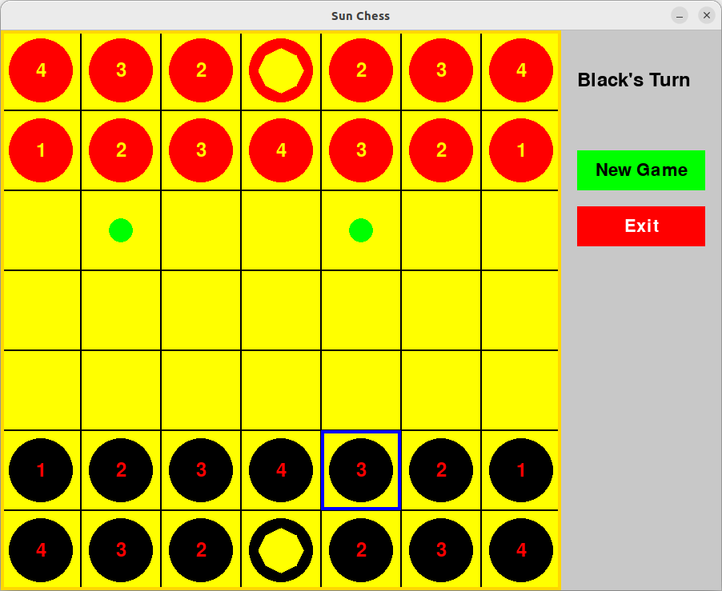

# Sun Chess (Cờ mặt trời)

Sun Chess is a unique chess variant implemented in Python using the Pygame library. This two-player strategy game features special movement rules and a distinctive win condition centered around the "Sun" piece.


## Game Rules

1. **Board**: The game is played on a 7x7 board.

2. **Pieces**: Each player has 14 pieces:
   - 13 numbered pieces (values 1-4)
   - 1 Sun piece (value 0)

3. **Initial Setup**:
   - Row 1: [4, 3, 2, 0, 2, 3, 4]
   - Row 2: [1, 2, 3, 4, 3, 2, 1]
   - (Mirrored for the opposite player)

4. **Movement**:
   - Pieces move in a straight line (horizontal, vertical, or diagonal).
   - The number of squares moved must exactly match the piece's value.
   - The Sun piece (0) moves like a piece with value 1 (one square in any direction).
   - Pieces can move through other pieces (both friendly and opponent pieces).

5. **Capture**: A piece captures by moving to a square occupied by an opponent's piece.

6. **Win Condition**: The game ends when a player's Sun piece is captured. The player who loses their Sun piece loses the game.

## Requirements

- Python 3.x
- Pygame 2.6.0

## Installation

1. Ensure you have Python installed on your system.
2. Install Pygame by running:
   ```
   pip install pygame==2.6.0
   ```
3. Download the `sun_chess.py` file from this repository.

## How to Play

1. Run the script:
   ```
   python sun_chess.py
   ```
2. The game window will open, showing the board on the left and an info panel on the right.
3. Players take turns moving pieces:
   - Click on a piece to select it.
   - Valid moves will be highlighted with green circles.
   - Click on a highlighted square to move the piece.
4. The info panel shows whose turn it is or who has won.
5. Use the "New Game" button to reset the board at any time.
6. Use the "Exit" button or close the window to end the game.

## Features

- Interactive GUI with a game board and info panel
- Turn indicator
- Valid move highlighting
- New Game and Exit buttons
- Winner display

## Contributing

Feel free to fork this project and submit pull requests with improvements or bug fixes. You can also open issues for any bugs you find or features you'd like to suggest.

## License

This project is open source and available under the [MIT License](https://opensource.org/licenses/MIT).